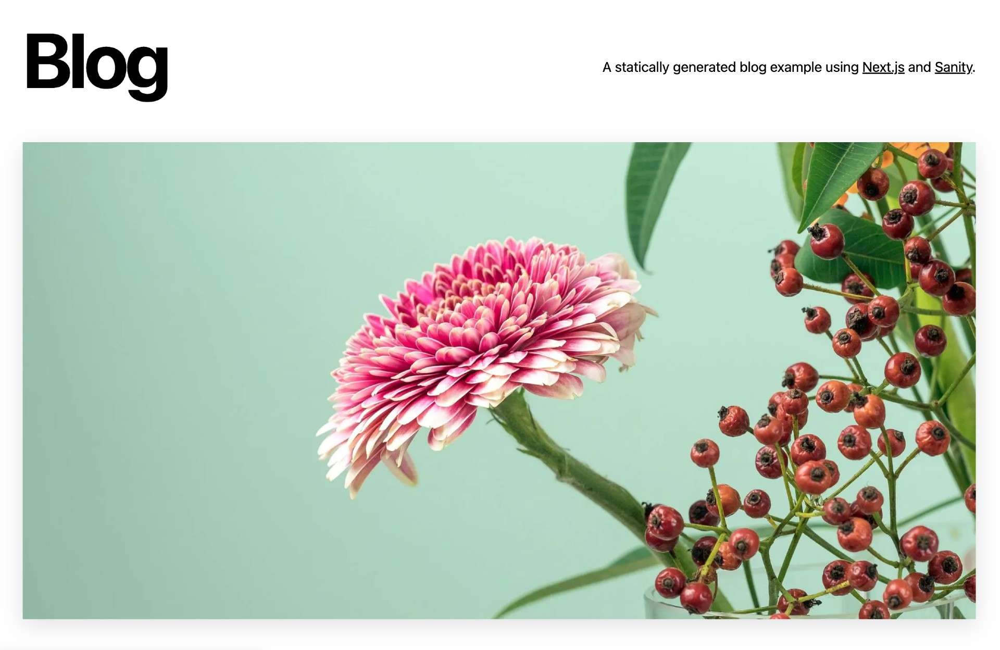
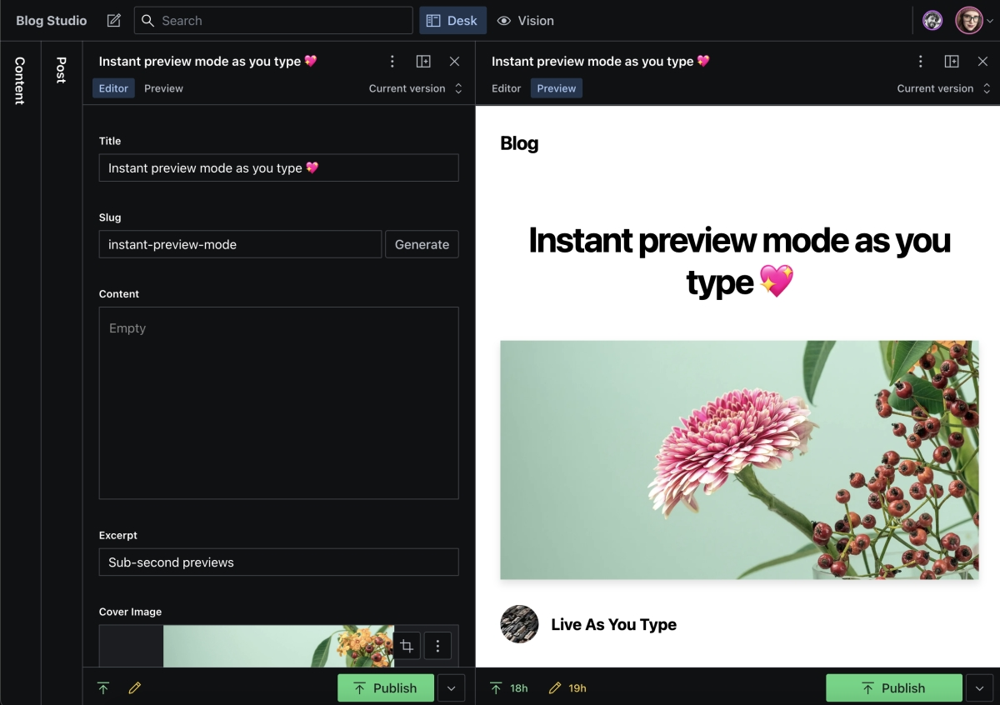

# Sanity.io and Next.js



Sanity.io is the platform for structured content. With Sanity.io you can manage your text, images, and other media with APIs and use the open-source single page application Sanity Studio to quickly set up an editing environment that you can customize.

This is a statically generated blog that uses Next.js and Sanity. It showcases Next.js's Static Generation feature using Sanity as the data source.

You'll get:

- Next.js deployed with the [Sanity Vercel Integration][integration].
- Sanity Studio running on localhost and deployed in the [cloud](https://www.sanity.io/docs/deployment).
- Sub-second as-you-type previews in Next.js
- [On-demand revalidation of pages](https://nextjs.org/blog/next-12-1#on-demand-incremental-static-regeneration-beta) with [GROQ powered webhooks](https://www.sanity.io/docs/webhooks)

## Demo

| [Blog](https://nextjs-blog.sanity.build)                              | [Studio](https://nextjs-blog.sanity.build/studio)                                |
| --------------------------------------------------------------------- | -------------------------------------------------------------------------------- |
| [](https://nextjs-blog.sanity.build) | [](https://nextjs-blog.sanity.build/studio) |

# Configuration

## Step 1. Set up the environment

Use the Deploy Button below, you'll deploy the example using [Vercel](https://vercel.com?utm_source=github&utm_medium=readme&utm_campaign=next-example) as well as connect it to your Sanity dataset using [the Sanity Vercel Integration][integration].

[][vercel-deploy]

## Step 2. Set up the project locally

[Clone the repository](https://docs.github.com/en/repositories/creating-and-managing-repositories/cloning-a-repository) that Vercel created for you and from the root directory of your local checkout.
Then link your clone to Vercel:

```bash
npx vercel link
```

Download the environment variables needed to connect Next.js and Studio to your Sanity project:

```bash
npx vercel env pull
```

<details>
<summary>You can also set up manually</summary>

- [Bootstrap the example](#bootstrap-the-example)
- [Set up environment variables](#set-up-environment-variables)
- [Import to Vercel](#import-to-vercel)

If using the [integration] isn't an option. Or maybe you want to work locally first and deploy to Vercel later. Whatever the reason this guide shows you how to setup manually.

### Bootstrap the example

Execute [`create-next-app`](https://github.com/vercel/next.js/tree/canary/packages/create-next-app) with [npm](https://docs.npmjs.com/cli/init), [Yarn](https://yarnpkg.com/lang/en/docs/cli/create/), or [pnpm](https://pnpm.io):

```bash
npx create-next-app --example https://github.com/sanity-io/vercel-next.js-examples-cms-sanity-studio-v3
```

```bash
yarn create next-app --example https://github.com/sanity-io/vercel-next.js-examples-cms-sanity-studio-v3
```

```bash
pnpm create next-app --example https://github.com/sanity-io/vercel-next.js-examples-cms-sanity-studio-v3
```

### Set up environment variables

Create a new [Sanity project](https://www.sanity.io/get-started/create-project) and at the end note the values for `--project` and `--dataset`:


In the above screenshot the `projectId` is `ygjibjo8` and `dataset` is `production`.

Copy the [`.env.local.example`] file in this directory to `.env.local` (which will be ignored by Git):

```bash
cp .env.local.example .env.local
```

Then set these variables in `.env.local`:

- `NEXT_PUBLIC_SANITY_PROJECT_ID` should be the `projectId`.
- `NEXT_PUBLIC_SANITY_DATASET` should be the `dataset`.
- `SANITY_API_READ_TOKEN` create an API token with `read-only` permissions:
  - Go to https://manage.sanity.io/ and open your project.
  - Go to **API** and the **Tokens** section at the bottom, launch its **Add API token** button.
  - Name it `SANITY_API_READ_TOKEN`, set **Permissions** to `Viewer`.
  - Hit **Save** and you can copy/paste the token.

Your `.env.local` file should look like this:

```bash
NEXT_PUBLIC_SANITY_PROJECT_ID=...
NEXT_PUBLIC_SANITY_DATASET=...
SANITY_API_READ_TOKEN=...
```

### Import to Vercel

To deploy your local project to Vercel, push it to [GitHub](https://docs.github.com/en/get-started/importing-your-projects-to-github/importing-source-code-to-github/adding-locally-hosted-code-to-github)/GitLab/Bitbucket and [import to Vercel](https://vercel.com/new?utm_source=github&utm_medium=readme&utm_campaign=next-example).
**Important**: When you import your project on Vercel, make sure to click on **Environment Variables** and set them to match your `.env.local` file.
After it's deployed link your local code to the Vercel project:

```bash
npx vercel link
```

</details>

## Step 3. Run Next.js locally in development mode

When working locally you can make changes to your blog and studio, and your changes are applied live using hot reloading.

```bash
npm install && npm run dev
```

```bash
yarn install && yarn dev
```

Your blog should be up and running on [http://localhost:3000](http://localhost:3000)! You'll be able to find the studio in [http://localhost:3000/studio](http://localhost:3000/studio).

In case of any issues, you can post on [GitHub discussions](https://github.com/vercel/next.js/discussions).

## Step 4. Deploy to production

To deploy your changes to production you use `git`:

```bash
git add .
git commit
git push
```

Alternatively you can deploy without a `git` hosting provider using the Vercel CLI:

```bash
npx vercel --prod
```

## Next steps

- [Join the Sanity community](https://slack.sanity.io/)
- [What is a schema?](https://www.sanity.io/docs/schema-types)
- [What is content modelling?](https://www.sanity.io/docs/content-modelling)
- [What is GROQ?](https://www.sanity.io/docs/groq)

[vercel-deploy]: https://vercel.com/new/clone?repository-url=https%3A%2F%2Fgithub.com%2Fsanity-io%2Fvercel-next.js-examples-cms-sanity-studio-v3&repository-name=blog-nextjs-sanity&project-name=blog-nextjs-sanity&demo-title=Blog%20using%20Next.js%20%26%20Sanity&demo-description=On-demand%20ISR%2C%20sub-second%20as-you-type%20previews&demo-url=https%3A%2F%2Fnextjs-blog.sanity.build%2F&demo-image=https%3A%2F%2Fuser-images.githubusercontent.com%2F110497645%2F182727236-75c02b1b-faed-4ae2-99ce-baa089f7f363.png&integration-ids=oac_hb2LITYajhRQ0i4QznmKH7gx
[integration]: https://www.sanity.io/docs/vercel-integration
[`.env.local.example`]: .env.local.example
[unsplash]: https://unsplash.com
